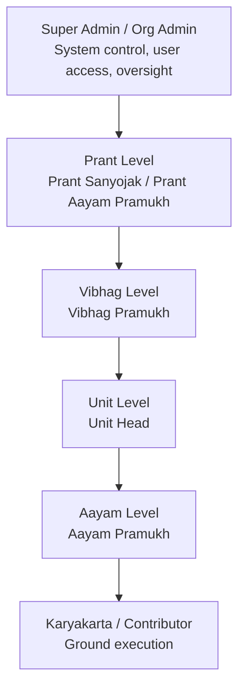
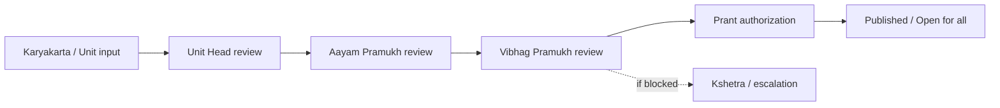
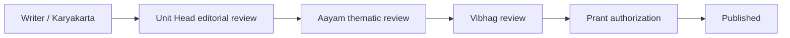
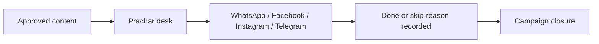

# Pragya Pravah ERP - Hierarchy and Workflow Check

This file is made in simple Hinglish so it can be shared with the client and edited later if needed.

## 1. Editable hierarchy chart

Use this Mermaid chart. Client can update labels, levels, or names directly in this file.



## 2. Simple hierarchy in layman Hinglish

```text
Super Admin / Org Admin
  -> pura system aur user access dekhte hain

Prant Level
  -> bada coordination level

Vibhag Level
  -> division level control aur approvals

Unit Level
  -> local execution aur reporting

Aayam Level
  -> function-wise responsibility
  -> jaise Yuva / Mahila / Shodh / Prachar / Vimarsh

Karyakarta
  -> actual ground work start karta hai
```

## 3. Editable workflow charts

### 3.1 Event / Gatividhi approval flow



### 3.2 Aalekh / article flow



### 3.3 Prachar follow-through flow



## 4. Current operation check - simple status

Below is the current app status in layman Hinglish.

| Area | Status | Layman meaning |
|---|---|---|
| Root entry `/` | Working | Site kholte hi ab ERP login flow par focus ho sakta hai. Public landing primary path nahi rehna chahiye / current branch mein ERP-first path implemented hai. |
| Login page | Working | User ko direct login panel milta hai. Demo role buttons bhi hain. |
| Login success flow | Working | Login hone ke baad user internal ERP side mein chala jata hai, public landing par nahi. |
| Logout | Working | User safely sign out kar sakta hai. |
| Dashboard / Gatividhi | Working | Event flow, queue, approvals aur review lane visible hain. |
| Aalekh workflow | Working | Writer -> Unit review -> Aayam review -> next approval chain flow available hai. |
| Prachar workflow | Working | Platform-wise completion aur skip-reason tracking chal raha hai. |
| Calendar | Working | Institutional planning / upcoming rhythm view available hai. |
| Sampark / Directory | Working | Ab protected hai; login ke bina direct visible nahi. |
| User / access management | Working for admin roles | Admin users accounts aur roles manage kar sakte hain. |
| ERP overview / oversight | Working on current branch | Login count summary, workflow load, hierarchy warnings aur admin-only detailed records available hain. |

## 5. What is clearly working

### Login and access
- Login page opens properly.
- Demo account fill works.
- Protected routes redirect to login when user is not signed in.
- Signed-in users can enter ERP flow.
- Sign out button is visible and usable.

### Workflow modules
- Dashboard opens and role-based workflow lanes are visible.
- Aalekh page changes by role.
- Prachar page shows campaign handling and follow-through.
- Calendar opens and shows planning surface.
- Sampark is protected behind login.

### Oversight / ERP home
- Summary-level system visibility is there:
  - login health
  - workflow load
  - prachar closure
  - hierarchy health
- All logged-in users can see summary-level health.
- Admin users can see exact login and actor detail.

## 6. What is partial / needs client confirmation

### Final hierarchy naming
- Technical hierarchy support exists.
- But client-side final naming and exact organisational mapping still needs confirmation.
- Especially:
  - exact real-world hierarchy labels
  - exact aayam count and names
  - whether Vimarsh is independent lane, aayam, or subject-discourse layer

### Dayitv / organisation page
- Page exists, but much of it is still presentation/static-style data.
- It is not yet a fully trusted live org-chart editor.

### Client-level hierarchy completeness
- System can now warn about missing role coverage.
- But if client changes structure, the seeded roles / assignments also need to be updated.

## 7. What is not fully done yet

### Final client-approved org chart
- Current system supports hierarchy technically.
- But the final client-approved exact org chart is still not fully locked in data form.

### Deep business analytics
- Current overview is operational.
- It is not a full BI dashboard with trend charts, comparative performance graphs, or productivity scoring.

### Complete live organisational mapping
- If client wants every real person / role / aayam / unit mapped exactly, that data still has to be entered and verified.

## 8. Why some things may still feel incomplete

Simple reason in layman Hinglish:

- `Structure bana hua hai`
  - system role-wise aur workflow-wise kaam kar raha hai
- `Real client data abhi poora feed nahi hua`
  - jahan actual hierarchy data nahi hai, wahan static/demo-like representation ho sakti hai
- `Naming clarity abhi bhi pending hai`
  - especially aayam count and final structure naming
- `Operational flow zyada mature hai than public explanation`
  - kaam ka engine relatively better hai, but organisation representation still needs client-level cleanup

## 9. How we checked this

Current branch was checked with:

```text
npm run typecheck
npm run build
npx playwright test e2e/demo-smoke.spec.ts
```

Latest smoke result:

```text
24 passed, 4 skipped
```

Meaning in simple words:

- core tested flows are working
- skipped tests usually mean conditional/demo-account or non-blocking path checks, not a hard app crash

## 10. Client edit section

Client can directly edit this section:

```text
Final hierarchy approved by client:

Level 1:
Level 2:
Level 3:
Level 4:
Level 5:

Final aayam list:
1.
2.
3.
4.
5.
6.
7.
8.

Notes:
- 
- 
- 
```
